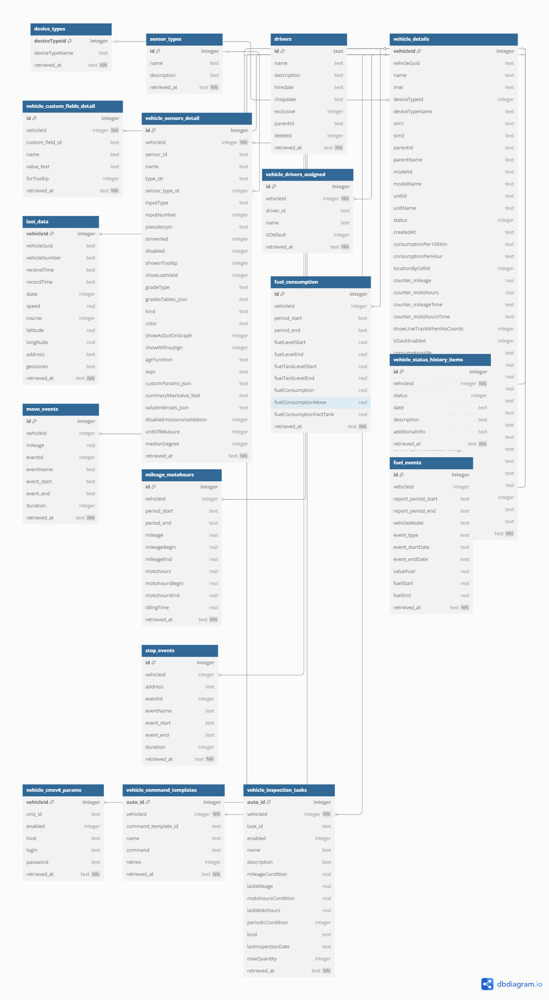

<p align="center">
  
</p>

API для управления иерархической справочной информацией о фабриках, участках и оборудовании на предприятии.
Приложение разработано на FastAPI с использованием SQLAlchemy для взаимодействия с базой данных и Alembic для управления миграциями схемы БД.

## Описание

Система позволяет:
- Создавать и управлять тремя основными справочниками: фабрики, участки,
  оборудование.
- Устанавливать иерархические связи:
  - Каждая фабрика может иметь один или несколько участков.
  - Каждый участок может содержать один или несколько единиц оборудования.
  - Каждая единица оборудования может принадлежать одному или нескольким
    участкам.
- Получать полную иерархическую структуру (родителей и детей) для любой
  сущности (фабрики, участка, оборудования).

## Технологический стек

- **Backend:** Python, FastAPI
- **ORM:** SQLAlchemy
- **Миграции БД:** Alembic
- **База данных:** SQLite
- **Сервер:** Uvicorn (+ Gunicorn для production)

### Шаги установки

1.  **Клонировать репозиторий:**
    ```bash
    git clone https://github.com/AVKharkova/factory_test.git
    ```

2.  **Создать и активировать виртуальное окружение:**
    ```bash
    python3 -m venv venv
    source venv/bin/activate  # для Linux/macOS
    venv\Scripts\activate    # для Windows
    ```

3.  **Установить зависимости:**
    ```bash
    pip install -r requirements.txt
    ```

4.  **Настройка базы данных:**

    Структура и связи между таблицами：
    

    Используется SQLite. Файл spravochniki.db создаётся автоматически при запуске приложения. Миграции применяются автоматически благодаря lifespan в app/main.py. Для создания новых миграций при изменении моделей в app/models.py выполните:
    ```bash
    alembic revision -m "Описание изменений"
    ```

### Запуск приложения

1.  **Запустить FastAPI приложение с помощью Uvicorn:**
    ```bash
    uvicorn app.main:app --reload --host 0.0.0.0 --port 8000
    ```
2.  **Доступ к приложению:**
    *   **Веб-интерфейс (UI):** `http://localhost:8000/`
    *   **Документация API (Swagger UI):** `http://localhost:8000/docs`
    *   **Альтернативная документация (ReDoc):** `http://localhost:8000/redoc`

## Тестирование

Проект включает два основных подхода к тестированию API

#### 1. Автоматизированные тесты с Pytest

В директории `tests/` находятся автоматизированные тесты, написанные с использованием фреймворка `pytest` и `TestClient` от FastAPI. Эти тесты проверяют основные CRUD-операции, логику активации/деактивации, обработку ошибок и получение иерархии для всех сущностей.

**Запуск Pytest тестов:**
Из корневой директории проекта, с активированным виртуальным окружением:
    ```bash
    pytest
    ```
Или с большей детализацией:
    ```bash
    pytest -v
    ```

Тесты используют отдельную базу данных test_spravochniki.db, которая создается и обновляется миграциями Alembic автоматически перед каждой тестовой сессией (см. tests/conftest.py).

#### 2. Тестирование с Postman
В директории tests/ также находится файл Postman.json. Это коллекция
запросов Postman для ручного или полуавтоматического тестирования API.

**Использование коллекции Postman:**
* Установите Postman.
* Запустите FastAPI приложение (см. "Запуск приложения").
* В Postman нажмите "Import" и выберите файл tests/Postman.json.
* Коллекция "Справочники API" появится в рабочем пространстве.
* Выполняйте запросы, проверяйте ответы и используйте переменные окружения Postman.

**Коллекция включает запросы для:**
* CRUD операций для фабрик, участков и оборудования.
* Эндпоинтов активации/деактивации.
* Получения иерархии.

### Запуск через Docker

1. **Собрать и запустить контейнер:**
Убедитесь, что у вас установлен Docker. В корневой директории проекта выполните команды:
    ```bash
    docker build -t factory_test .
    docker run -d -p 8000:8000 --name factory_test_container factory_test
    ```
Приложение будет доступно по адресу http://localhost:8000. Миграции Alembic
применяются автоматически при старте контейнера. Примечание: Данные SQLite
по умолчанию сохраняются внутри контейнера и теряются при его удалении.
См. раздел "Сохранение данных SQLite в Docker" для сохранения данных.

2. **Остановить контейнер:**
    ```bash
    docker stop factory_test_container
    ```

3. **Удаление контейнера:**
    ```bash
    docker rm factory_test_container
    ```

### Сохранение данных SQLite в Docker

Файл `spravochniki.db` создаётся внутри контейнера и теряется при удалении.
Для сохранения данных используйте Docker Volumes.

1. **Создайте Docker Volume:**
   ```bash
   docker volume create factory_test_db_data
   ```

2. **Запустите контейнер с Volume:**
   ```bash
    docker run -d -p 8000:8000 \
    --name factory_test_container \
    -v factory_test_db_data:/app/db_volume \
    --env SQLALCHEMY_DATABASE_URL=sqlite:////app/db_volume/spravochniki.db \
    factory_test
   ```
Убедитесь, что приложение поддерживает динамическое задание SQLALCHEMY_DATABASE_URL 
через переменную окружения (см. app/database.py).

---
## Автор
**[Анастасия Харькова](https://github.com/AVKharkova)**
